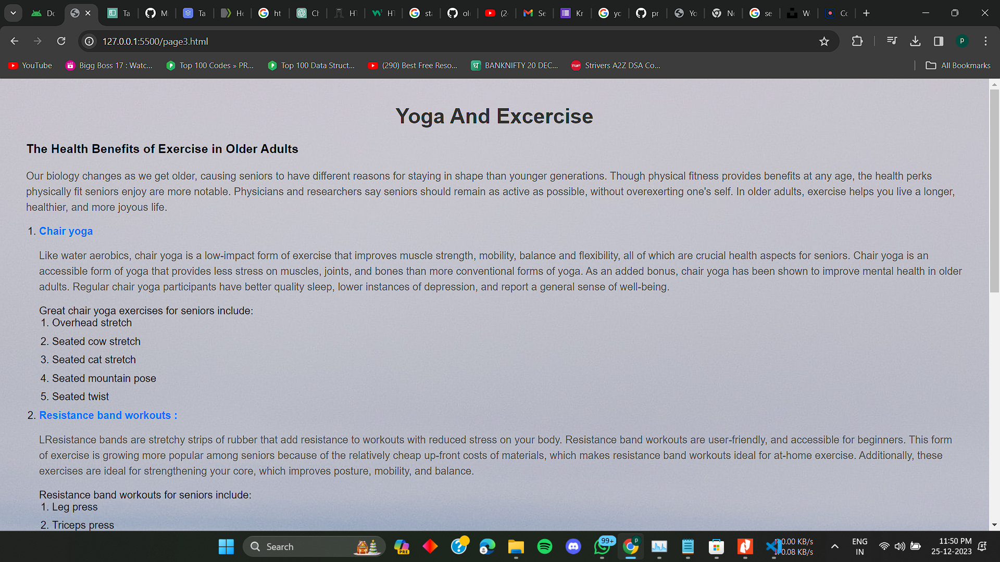

# oldagecaresystem
this web application helps elder old age people and guide them about common health tips and teach them about yoga and excercise

The Old Age Care System is a web-based platform designed to provide valuable information and resources for the well-being of elderly individuals. This project includes four HTML pages, each focusing on a specific aspect of elderly care:

1. ## Basic Tips
   The "page1.html" page offers fundamental advice and tips for the daily care of senior citizens. It covers a range of topics including safety, hygiene, and general well-being.

2. ## Balanced Diet
   Navigate to "page2.html" to access information about maintaining a healthy and balanced diet for the elderly. The page includes dietary recommendations, meal planning tips, and nutritional insights tailored for seniors.

3. ## Yoga and Exercise
   For promoting physical activity and flexibility, the "page3.html" page provides guidance on suitable yoga routines and exercises for the elderly. It emphasizes the importance of maintaining an active lifestyle.

4. ## Medication
   The "page4.html" page is dedicated to information about medication management for seniors. It includes guidance on proper medication schedules, potential side effects, and the importance of regular check-ups.

## Future goals
    Medicine Reminder
    Emergency contacts with locations
    Locate nearby hospital
    Emergency Video Call
    Home location Finder
## ScreenShots
-1.png>)
.png>)
.png>)

## How to Use
To explore the content, simply open each HTML file in a web browser. The navigation is straightforward, and users can easily switch between the different topics using the links provided.

